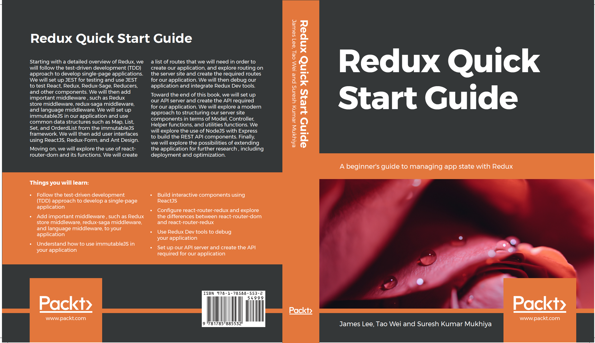

# Preface

This book explores methodologies for developing a scalable modern web application using
cutting edge front-end technologies. The book is intended for web developers, frontend
developers and beginner programmers who want to use React and Redux to develop a
modern web application. In this book, We will show you how you can integrate Redux
with `React` and other front end `JavaScript` frameworks efficiently and manage application
states effectively. Finally, we will explore the architecture of `Redux-Saga` and see how saga
can be used in handling side effects.

<figure>
    
    <figcaption>
Redux Quick Start Guide
</figcation>
  </figure>

We will follow the `TDD` (Test Driven Development) paradigm in this book where we test
each piece of code we develop. We will use the `JEST` framework for testing. In addition to
that, we will learn about advanced debugging techniques using `Redux Dev tools`. In this
book, we will build a simple multi-lingual simple Hospital Management System to perform
`CRUD` (Create, Read, Update and Delete) on users. We will use React to build interactive
user interfaces and we will take help of `Redux-form` and `Ant design` to exploit user
interfaces for our need. Finally, we will explore using styled components to include `CSS` in
our application.

<!-- Place this tag where you want the button to render. -->

<a class="github-button" href="https://www.packtpub.com/web-development/redux-quick-start-guide" data-icon="octicon-cloud-download" aria-label="Download ntkme/github-buttons on GitHub">Download Now</a>

To develop a scalable web application, project architecture, correct tooling and use of a
right stack is very important. With numerous options, developers easily get confused about
the choice of database, choice of frontend technologies, types of module bundler to use and
so on. In this book, we will guide users through a single application architecture paradigm
using cutting edge technology ReactJS with `Redux` for state management and Redux-Saga
for handling side effects.

# Target Audience

Any Web developer or UI/UX developers will be able to benefit from this book. The book
will guide you seamlessly from beginner concept of setting up tools to the advanced
debugging concept. In addition to that, the book will enforce using TDD (Test Driven
Development) paradigm that will help you to understand the logic easily and verify the
code written is valid. In addition to that, the book will help you to create a full production
app ready to be hosted in the server of your choice.

# What this book covers

- Chapter 1, **Understanding Redux**, provides a detailed overview of redux, its fundamental principles, and a unified approach to redux echo system. In addition to that, we will discuss
  redux life cycle, action creators, redux and redux store. We will be discussing in detail
  about the need of these components in management of state. Finally, we initiate our project
  and set up nodejs, webpack, babel, redux, and Yarn.

- Chapter 2, **Testing**, follows Test Driven Development (TDD) approach to develop single
  page application. In this chapter we will discuss about why TDD approach is effecient in
  building scalable system. In addition to that, we will explore how we can set up JEST for
  testing and how we can use JEST to test React, Redux, Redux-Sage, Reducers and other
  components.

- Chapter 3, **Routing**, explores about routing and its need. We will then explore the use react-
  router-dom and its functions. We will create list of routes that we will need in order to create our application. In addition to that, we will configure react-router-redux in our application and explore the difference between react-router-dom and react-router-redux. Finally, we will explore routing on the server site and create ther required routes for our application.

- Chapter 4, **Concept of Immutability**, deals about immutability, its importance. We will set up
  immutableJS in our application and convert our reducers, stores in immutableJS
  architecture. We will be using some of the most common data structures like `Map`, `List`, `Set`,
  `OrderdList` from `immutableJS` framework. Finally, we will explore how immutable JS can
  be tested.

- Chapter 5, **React with Redux**, deals with building interactive component using ReactJS.
  Moreover, we will be connecting react with redux, understand component life cycle, states
  in react and understand various performance parameters of react component. Finally, we
  will continue our application and add user interfaces using ReactJS, Redux-Form and Ant
  Design.

- Chapter 6, **Extending Redux by Middleware**, explores about middleware and its need. In
  addition to that, we will continue our application and add three important middlewares in
  to our application including redux-store middle ware, redux-saga middle ware and
  language middle ware. We will explore other aspects of redux-saga and discuss how it can
  be used in handling side effects.

- Chapter 7, **Debugging Redux**, in chapter, we will understand about the concept of
  debugging and what types of tools we can use in order to debug our application. It is very
  unlikely that user will code everything with hundred percent accuracy. There can be logical
  error, syntax error or semantic error. Understanding error from the browser, library or
  server is a very important skill. Here we will explore how we can integrate redux dev tools.
  In addition to that, we will integrate `Hot Module Reloading` and explore its benefits. Finally, we will understand about using Redux Dev tools.

- Chapter 8, **Understanding REST API**, finally in the last chapter, we will set up our API
  server and create ther required API required for our application. We will create GET, POST,
  PUT, and DELETE routes for our required module. We will explore a modern approach to
  structure our server site components in terms of Model, Controller, Helper functions and
  utilities functions. We will explore use of nodeJS with express to build the `REST API`
  components. Finally, we will explore the possibilities of extending the application for
  further research like deploying, and optimization.
