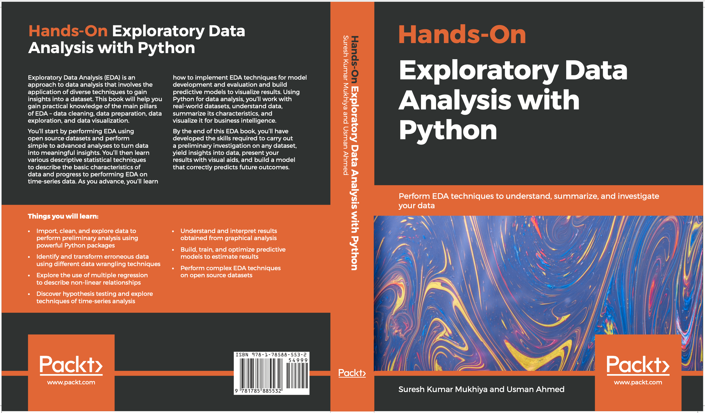

# Preface

Exploratory Data Analysis (EDA) is an approach to data analysis that involves the application of diverse techniques to gain insights into a dataset. This book will help you gain practical knowledge of the main pillars of EDA - data cleaning, data preparation, data exploration, and data visualization.

You’ll start by performing EDA using open source datasets and perform simple to advanced analyses to turn data into meaningful insights. You’ll then learn various descriptive statistical techniques to describe the basic characteristics of data and progress to performing EDA on time-series data. As you advance, you’ll learn how to implement EDA techniques for model development and evaluation and build predictive models to visualize results. Using Python for data analysis, you’ll work with real-world datasets, understand data, summarize its characteristics, and visualize it for business intelligence.

By the end of this EDA book, you’ll have developed the skills required to carry out a preliminary investigation on any dataset, yield insights into data, present your results with visual aids, and build a model that correctly predicts future outcomes.

<figure>
    
    <figcaption>
Hands-On Exploratory data analysis
</figcation>
  </figure>

EDA is one of the crucial steps in data science that allows us to achieve certain insights and statistical measures that are essential for the business continuity, stockholders and data scientists. The main pillars of EDA are data cleaning, data preparation, data exploration, and data visualization. Having a clean dataset in hand, we need to understand the data, summarize its characteristics, and visualize it.

# Target Audience

This book is compiled for anyone who intends to analyze data including students, teachers, managers, engineers, statisticians, data analysts, and data scientists. The practical concepts presented in this hands-on book are applicable for applications in various disciplines including linguistics, sociology, astronomy, marketing, business, management, quality control, education, economics, medicine, psychology, engineering, biology, physics, computer science, geosciences, chemistry any other fields where the need for data analysis and synthesis is required in order to improve knowledge and help in decision-making process. A fundamental knowledge of Python programming and statistical concepts is all you need to get started with this book.

# Why should you read this book?
Data encompasses a collection of discrete objects, events out of context, and facts. Processing *data* provides a multitude of *information*. Processing *information* based on our experience, judgment or jurisdiction elicits knowledge as the result of learning. But the million-dollar question is - *how do we get meaningful information from data*? The answer to this is **Exploratory Data Analysis (EDA)** as a process for investigating datasets, elucidating subjects, and visualizing the outcomes. EDA is an approach for data analysis that applies a diversity of techniques to maximize certain insights into a data set; reveal underlying structure; extract significant variables; detect outliers and anomalies; test underlying assumptions; develop models, and determine best parameters for future estimations. 

This book "Hands-On Exploratory Data Analysis with Python" is built on providing practical knowledge about the main pillars of EDA including data cleaning, data preparation, data exploration, and data visualization. Why visualization? Several research studies reveal portraying data in graphical form is clearer and makes complex statistical data analyses and business intelligence more marketable. 

The readers will get the opportunity to explore open-source datasets including healthcare data, demographics data, Titanic dataset, the wine quality dataset, automobile dataset, Boston housing pricing, and many others. Using these real-life datasets,  the readers get hands-on practice to understand the data, summarize their characteristics and visualize them for business intelligence. The book expects readers to use Pandas, a powerful library for working with data, and other core Python libraries including NumPy and SciPy, StatsModels for regression, and Matplotlib for visualization. 

# What this book covers

**Chapter 1, Exploratory Data Analysis Fundamentals**, will help us learn and revise the fundamental aspects of EDA. We will dig into the importance of EDA and the main data analysis tasks, and try to make sense out of data. In addition to that, we will use Python to explore different types of data, including numerical data, time series data, geospatial data, categorical data, and others.

**Chapter 2, Visual Aids for EDA**, will help us gain proficiency with different tools for visualizing the information that we get from investigation and make analysis much clearer. We will figure out how to use data visualization tools such as box plots, histograms, multivariate charts, and more. Notwithstanding that, we will get our hands dirty in plotting an enlightening visual graph using real databases. Finally, we will investigate the intuitive forms of these plots.

**Chapter 3, EDA with Personal Email**, will help us figure out how to import a dataset from your personal Gmail account and work on analyzing the extracted dataset. We will perform
basic EDA techniques, including data loading, data cleansing, data preparation, data
visualization, and data analysis, on the extracted dataset.

**Chapter 4, Data Transformation**, is where you will take your first steps in data wrangling. We will see how to merge database-style DataFrames, merge on the index, concatenate along an axis, combine data with overlaps, reshape with hierarchical indexing, and pivot from long to wide format. We will look at what needs to be done with a dataset before analysis takes place, such as removing duplicates, replacing values, renaming axis indexes, discretization and binning, and detecting and filtering outliers. We will work on transforming data using a function or mapping, permutation, and random sampling and computing indicators/dummy variables.

**Chapter 5, Descriptive Statistics**, will teach you about essential statistical measures for gaining insights about data that are not noticeable at the surface level. We will become familiar with the equations for computing the variance and standard deviation of datasets figuring out percentiles and quartiles. Furthermore, we will envision those factual measures with visualization. We will use tools such as box plots to gain knowledge from statistics.

**Chapter 6, Grouping Datasets**, will cover the rudiments of grouping and how it can change our datasets in order to help us to analyze them better. We will look at different group-by mechanics that will amass our dataset into various classes in which we can perform aggregate activities. We will figure out how to dissect categorical data with visualizations, utilizing pivot tables and cross-tabulations.

**Chapter 7, Correlation**, will help us to understand the correlation between different factors and to identify to what degree different factors are relevant. We will learn about the different kinds of examinations that we can carry out to discover the relationships between data, including univariate analysis, bivariate analysis, and multivariate analysis on the Titanic dataset, as well as looking at Simpson's paradox. We will observe how correlation does not always equal causation. 

**Chapter 8, Time Series Analysis**, will help us to understand time-series data and how to perform EDA on it. We will use the open power system data for time series analysis. 

Chapter 9, Hypothesis Testing and Regression, will help us learn about hypothesis testing and linear, non-linear, and multiple linear regression. We will build a basis for model development and evaluation. We will be using polynomial regression and pipelines for model evaluation. 

**Chapter 10, Model Development and Evaluation**, will help us learn about a unified machine learning approach, discuss different types of machine learning algorithms and evaluation techniques. Moreover, in this chapter, we are going to perform the unsupervised learning task of clustering with text data. Furthermore, we will discuss model selection and model deployment techniques. 

**Chapter 11, EDA on Wine Quality Data**, will teach us how to use all the techniques learned throughout the book to perform advanced EDA on a wine quality dataset. We will import the dataset, research the variables, slice the data based on different points of interest, and perform data analysis.

# Where can I find the book?

| Store       	| Link                                                                                          	|
|-------------	|-----------------------------------------------------------------------------------------------	|
| Google Book 	| https://books.google.no/books?id=QcHZDwAAQBAJ                                                 	|
| Amazon      	| https://www.amazon.com/Hands-Exploratory-Data-Analysis-Python/dp/1789537258                   	|
| PACKT       	| https://www.packtpub.com/product/hands-on-exploratory-data-analysis-with-python/9781789537253 	|
| Adlibris    	| https://www.adlibris.com/no/bok/hands-on-exploratory-data-analysis-with-python-9781789537253  	|
| O'Reilly    	| https://www.oreilly.com/library/view/hands-on-exploratory-data/9781789537253/                 	|