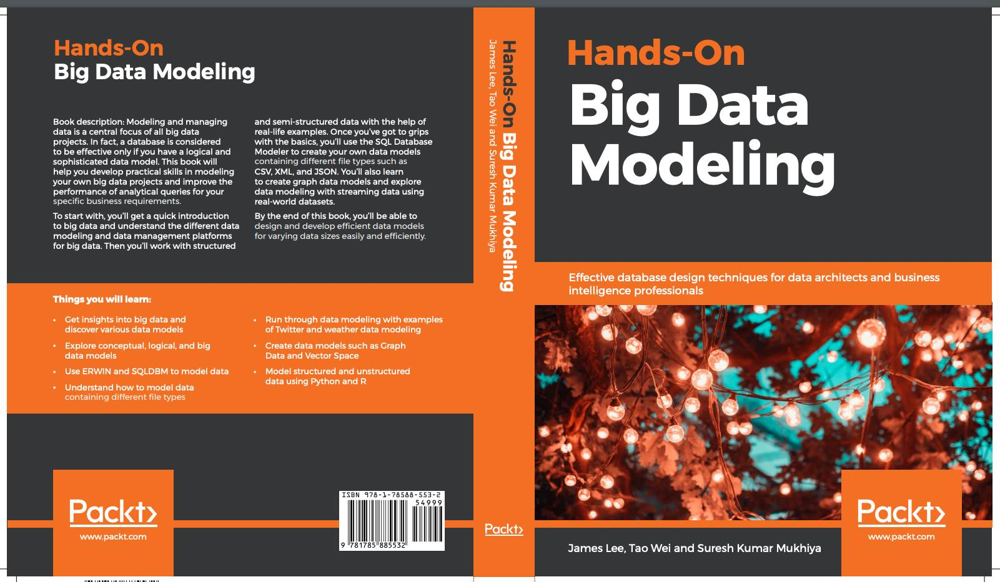

### Preface

Modeling and managing data is a central focus of all big data projects. In fact, a database is considered to be effective only if you have a logical and sophisticated data model. This book will help you develop practical skills in modeling your own big data projects and improve the performance of analytical queries for your specific business requirements.

To start with, you’ll get a quick introduction to big data and understand the different data modeling and data management platforms for big data. Then you’ll work with structured and semi-structured data with the help of real-life examples. Once you’ve got to grips with the basics, you’ll use the `SQL Developer` Data Modeler to create your own data models containing different file types such as `CSV`, `XML`, and `JSON`. You’ll also learn to create graph data models and explore data modeling with streaming data using real-world datasets.

By the end of this book, you’ll be able to design and develop efficient data models for varying data sizes easily and efficiently.

<figure>
    
    <figcaption>
Hands-On Big Data Modeling
</figcation>
  </figure>

The Hands-On Big Data Modelling series explores the methodology required to model big data using open source platforms in real-world contexts. The rapid growth of big data and people's interest in extracting business intelligence from data have given an opportunity to explore various technologies and methods that can be applied in modeling, mining, and analytics generation. In this book, we are going to use open source tools such as `Python`, `R`, `Gephi`, `Lucene`, and `Weka` to explore how big data modeling can be facilitated. The main objectives of this book are as follows:

- To understand the concept of big data, the sources of big data, and the importance and implications of big data and big data management.
- To understand state-of-the-art big data modeling, the importance of big data modeling, big data applications, and programming platforms for big data analysis.
- To encourage a range of discussion of concepts, from Database Management Systems (DBMSes) to Big Data Management Systems (BDMSes).
- To facilitate the planning, analysis, and construction of data models through an actual database for small to enterprise-level database environments.
- To understand the concept of unified data models for structured, semi-structured, and unstructured data, including finding classes, adding attributes, and simplifying the data structures, followed by advanced data modeling techniques and performance scaling of models.
- To facilitate working with streaming data with the help of examples on Twitter feeds and weather data points.
- To understand how we can model using open access data such as Bitcoin, IMDB, Twitter, and weather data using Python.

<a href="https://www.packtpub.com/big-data-and-business-intelligence/hands-big-data-modeling" data-icon="octicon-cloud-download" aria-label="Download ntkme/github-buttons on GitHub">Download Now</a>

### Target Audience

`Hands-On Big Data Modeling` is for you if you are a data modeler, data architect, ETL
developer, business intelligence professional, or anyone who wants to design sophisticated
and powerful database models. Basic programming skills using `Python`, `R`, or any other
programming language will be beneficial.

### What this book covers

- Chapter 1, **Introduction to Big Data and Data Management**, covers the concept of big data, its sources, and its types. In addition to this, the chapter focuses on providing a theoretical foundation in data modeling and data management, including data ingestion, data storage, data quality, data operations, data scalability, and security, as well as the importance and implications of big data modeling and data management. The user will be getting their hands dirty with real big data and its sources.

- Chapter 2, **Data Modeling and Management Platforms**, provides an in-depth theoretical background to data modeling and data management. Users will learn about big data applications, state-of-the-art modeling techniques, and programming platforms for big data analysis involving use case examples. Readers will be using big data from various sources to perform data ingestion, storage, data quality, and various data operations. This chapter also focuses on various real big data applications and big data programming models. In addition to this, it discusses various programming platforms used for big data analysis, including Python, R, Scala, and many more.

- Chapter 3, **Defining Data Models**, walks users through various structures of data, including structured, semi-structured, and unstructured data, and how to apply modeling techniques to them. In addition, users will become familiar with various operations on data models and various data model constraints. Moreover, the chapter gives a brief introduction to a unified approach to data modeling and data management. Hands-on exercises concerning structured Comma-Separated Value (CSV) data will help users to get a better insight into these terms and processes.

- Chapter 4, **Categorizing Data Models**, focuses on providing both theoretical and practical guidelines regarding different types of data models, including a conceptual data model, a logical data model, a physical data model, a traditional data model, and a big data model. In addition to this, users will get to know different real-life examples of these models and how they differ from the big data model.

- Chapter 5, **Structures of Data Models**, continues to shed light on big data modeling through specific approaches, including vector space models, graph data models, and more. Users will become acquainted with the concept of different structures of data model using hands-on exercises, including the exploration of graph data models with `Gephi`, and utilizing the semi-structured data models of `JSON` files.

- Chapter 6, **Modeling Structured Data**, provides real-life examples of structured data found in everyday business through to the enterprise level, and how modeling can be applied to this data. Users will get their hands dirty using Python or the R programming language.

- Chapter 7, **Modeling with Unstructured Data**, provides real-life examples of unstructured data found in everyday business through to the enterprise level, and how modeling can be applied to this data. Users will get their hands dirty using `Python` or the `R` programming language.

- Chapter 8, **Modeling with Streaming Data**, provides users with the opportunity to explore data models and data formats, the concept of data streaming and why streaming data is different, as well as the importance and implications of streaming data.

- Chapter 9, **Streaming Sensor Data**, provides users with the opportunity to acquire practical hands-on experience working with different forms of streaming data, including weather data and `Twitter` feeds.

- Chapter 10, **Concept and Approaches of Big Data Management**, deals with exploring various DBMS and non-DBMS-based approaches to big data. It also focuses on the advantages of using `DBMS` over the traditional filesystem, and the differences between parallel and distributed filesystems and MapReduce-style `DBMS`.

- Chapter 11, **DBMS to BDMS**, introduces users to some of the applications available to help with big data management and provides insights into how and when they might be appropriate for the big data management challenges we face.

- Chapter 12, **Modeling Bitcoin Data Points with Python**, covers the different types of models that can be constructed from bitcoin data. We will try to use the model thus extracted to predict the price of bitcoin. In addition to this, we will learn how to use iPython in detail and play with `Python` libraries, including `pandas` and `NumPy`.

- Chapter 13, **Modeling Twitter Feeds with Python**, uses Twitter feeds as big data and utilizes them in Python to produce models on the basis of tips and tricks learned throughout the book as a whole. The book tries to consume the data in raw format, transform it into the correct format and model using `Python`, and interpret the model thereby produced.

- Chapter 14, **Modeling Weather Data Points with Python**, uses weather data points as big data and utilizes them in R to produce models on the basis of tips and tricks learned throughout the book as a whole. The book tries to consume the data in raw format, transform it into the correct format and model using `R`, and interpret the model thereby produced.

- Chapter 15, **Modeling IMDb Data Points with Python**, uses IMDb data points as big data and utilizes them in `Python` to produce models on the basis of tips and tricks learned throughout the book as a whole. The book tries to consume the data in raw format, transform it into the correct format and model using `Python`, and interpret the model thereby produced.
